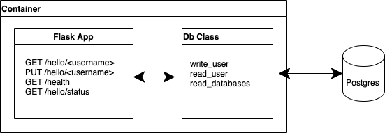

# revolut-challenge

## **Endpoint**
```
curl https://revolut-challenge.marianobilli.link/hello/usertest
```

## **Infrastructure**
### Design
<p>The infrastructure is deployed on a public subnet with internet access via Internet gateway. Tipically the cluster would be deployed on a private subnet with access to internet via a nat gateway but in this case for simplicity it was done like this.</p>

### **Terraform**
All infrastructure is created with terraform.
- VPC, Subnets, Route Tables, Internet gateway, segurity groups
- IAM roles and policies
- Kubernetes Cluster
- RDS (Database)
- FluxCD Manifests (https://fluxcd.io/)

#### **Pre requisites**
- Route53 Zone
- aws api user with admin access configured locally
#### **Infrastructure implementation**
```
$ cd terraform
$ terraform init
$ terraform apply -auto-aprove
```
#### **Secrets**
Upon execution of terraform it will ask the master password for the database
<p>Tipically the password would not be passed locally but rather fetched in terraform itself from a secret management store such as vault or aws secrets manager</p>

#### **Diagram**
<p align="left">
  
</p>

## **Kubernetes**
All configuration is applied via FluxCD which pulls all kubernetes manifests from this github repo and applies all found in kubernetes/ folder.
- external-dns ( to manage dns configuration )
- aws-application-load-balancer-controler ( to manage alb )
- cluster-autoscaler ( to manage autoscaling groups for scale-out/in based on cluster load )
- metric-server ( for measuring cluster load )
- revolut-challenge application 

#### **Diagram**
<p align="left">
  
</p>

## **CI/CD**
### CI
<p>As shown in the Kubernetes diagram upon release of new version in github the image is built using Github actions and pushed to GHCR. Also there is another pipeline to execute unit tests.</p> 
<p> All of this can be integrated into a single pipeline that pushes the image only upon succesfull tests.</p>

### CD
<p>CD is done with FlucCD which upon update of the manifests in github it will detect the change and pull the new version from the contaner registry</p>

## **Application**
The application is written in python and uses the following libraries
- Flask
- SQLAlchemy
- Pytest

#### **Diagram**
<p align="left">
  
</p>

## **Testing**
Setup, testing, runing and cleaning up is all encapsulated in the make file. `Python3` and `Docker` have to be installed
```
# To run all tests
$ make tests
```
<p align="left">
  
</p>
<p align="left">
  
</p>

## **Local Execution**
```
# To start the service locally (the output will give some curl examples on how to call the service)
$ make run

# If you want to run the app locally ensure to have running db 
$ make run-standalone-db

# To stop and cleanup all containers
$ make clean
```